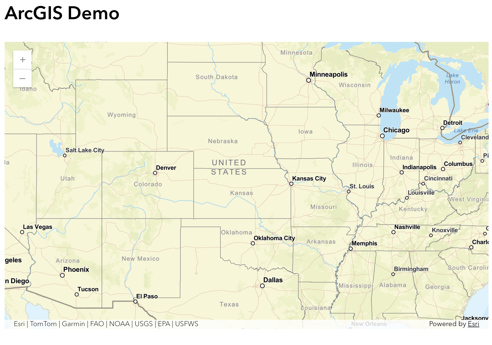

## React + ArcGIS JavaScript API Map Component

Interactive mapping component built with **React** and the **ArcGIS JavaScript API**.

*Example map rendered using the ArcGIS JavaScript API inside a React component.*

## Overview

This project demonstrates how to embed an ArcGIS map inside a React application using the ArcGIS JavaScript 4.x API.

The component renders an interactive map centered on the United States and includes a marker placed on Houston, TX.

## Tech Stack

- React
- ArcGIS JavaScript API (@arcgis/core)
- Vite
- JavaScript (ES6)

## Features

- Interactive ArcGIS map
- React component-based architecture
- Custom marker rendering
- Popup support for geographic locations